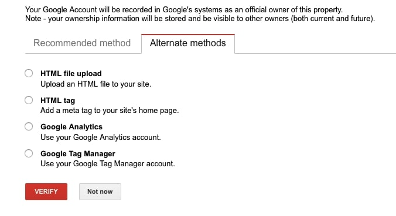

In order to verify you gatsby site, first you would need to use one of the verification method that the search console suggests. Below you can see the options you can select for verifying the site.



In this post I will be showing how you can verify the site using the HTML meta tag. To do so, we would need to install a couple of modules so that you can insert the meta tag in the head with the help of these modules.

## Install

In order to add the meta tag to the document head, you need to install React helmet component which allow us to modify the document head using it and to install gatsby-react-helmet-plugin which provide supports for server rendering data added with React Helmet.

```javascript
npm install --save gatsby-plugin-react-helmet react-helmet
```

## How to use

Once you have these modules installed, then we need to add the gatsby plugin to the config file as follow

```javascript
//gatsby-config.js
plugins: ['gatsby-plugin-react-helmet'];
```

Now we insert the meta tag data in head with the help of React Helmet component that we installed earlier. As this is beneficial for SEO when we have the title and description metadata stored in head which is used by Google to determine the placement of the site in the search results.

Below you can see an example of how we can insert the HTML meta tag so that search console can verify the site

```javascript
//index.js
import Helmet from 'react-helmet';
<Helmet>
  <html lang="en" />
  <title>{site.siteMetadata.title}</title>
  <meta
    name="google-site-verification"
    content="rdHgeMNE19n12z27_OXvkv_MuTFSHl8lQPesFHLk21oU"
  />
</Helmet>;
```
